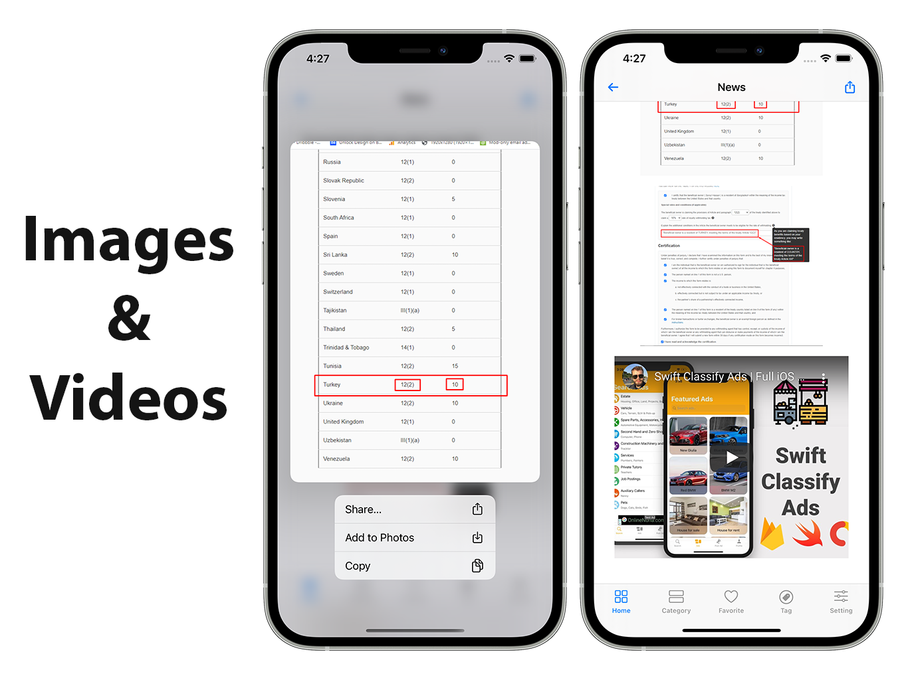
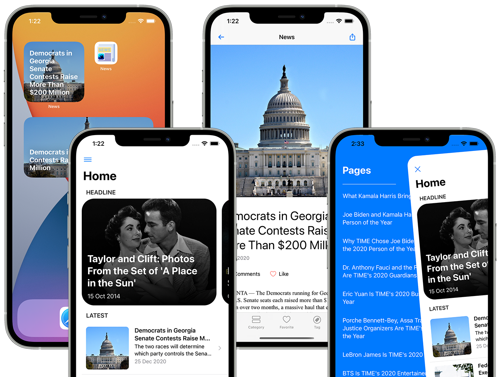

# Blog & News

SwiftUI iOS  App for blog posts, images, pages, categories and tags and show in a well designed layout.

## App Features

- SwiftUI iOS 14 Support
- Wordpress Rest Api
- Firebase Push Notification with WordPress plugin
- Google Admob Interstitial Ad
- In-App Purchases
- iOS Widgets
- Favorite Posts
- Post comments and create comment
- Post Image and Video Support
- Youtube Embed Video Support
- Amazing and minimal design
- Fully step by step documentation
- 100% Ready to style and publish on AppStore
- Easy to re-skin
- Beautiful and professional looking design
- Nice and minimal iOS native design
- List of cool resources to use
- Super lightweight application
- Automatically send a push notification when you publish new a post

